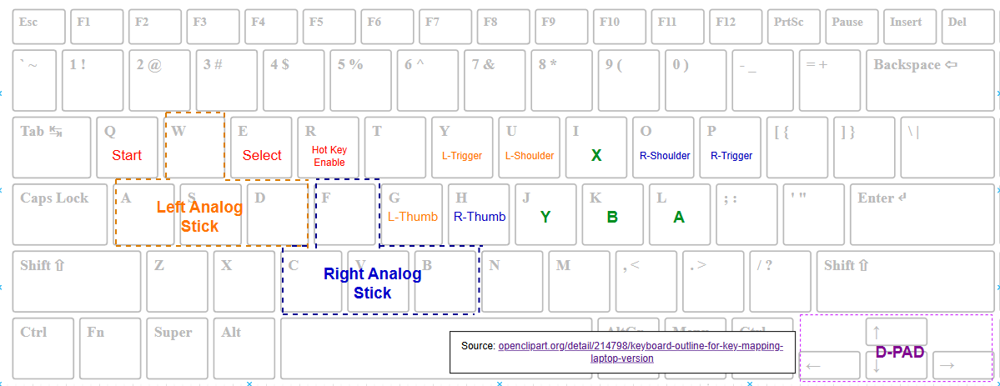

# Emulation Station
A graphical emulator frontend that makes it easy to navigate through many common programs.

**Repository:** https://github.com/qnx-ports/emulationstation \
**Upstream:** https://github.com/RetroPie/EmulationStation \
**Website:** https://emulationstation.org/ \
**Supports:** IN PROGRESS

## Default Keyboard Mappings

Note that these are only installed automatically via the `build_install_all.sh` script. You can manually copy these over via `scp` to your user's `~/.emulationstation/`.
